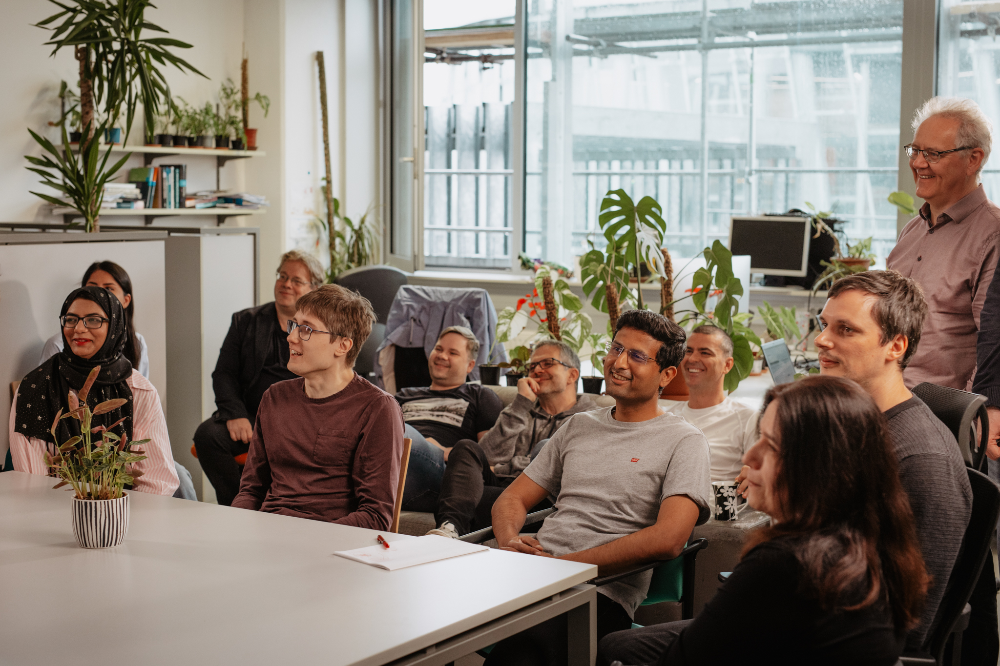

+++
title = ''
date = 2025-02-04T11:01:48+01:00
draft = false
+++



## Laboratory for **Machine Learning** and **Language Technologies (MLLT)**

 

We are a scientific laboratory specialising in research and development in the fields of machine learning and language technologies.



  

  


  


  

   



OUR WORK

#### **Our work focuses on understanding and processing language in various contexts such as healthcare, digital humanities, and pharmacy.**

  

We explore the fields of data mining, neural networks, artificial intelligence, big data analysis, and large-scale data stream analysis.





  

   



VISION AND VALUES

  

#### **Our goal is the creation, exchange, and   transfer of knowledge**



{{< benefits 
  card1="**Our Goal**  Our goal is to create, exchange, and transfer knowledge in the fields of machine learning and language technologies."
  card2="**Projects**  We lead numerous national and international projects, including both applied and theoretical research. We focus on solving real-world challenges while deepening the fundamental understanding of these fields."
  card3="**Our Work**  Our work is based on a commitment to interdisciplinarity and multidisciplinarity. We combine knowledge and approaches from various scientific disciplines to foster innovation and strengthen collaboration between research groups at both the national and international level." 
>}}



NEWS

  

#### **Latest News**



  





  



  


