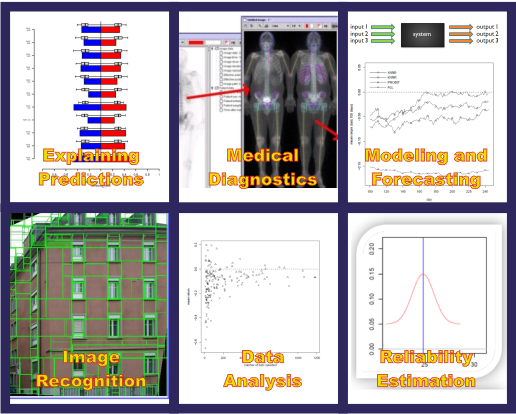
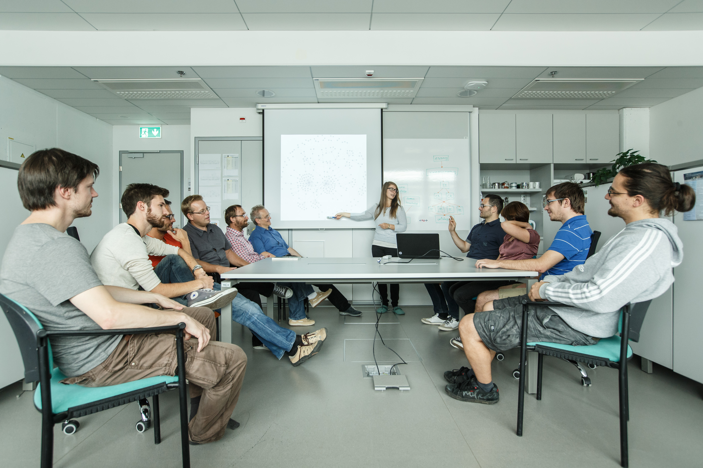
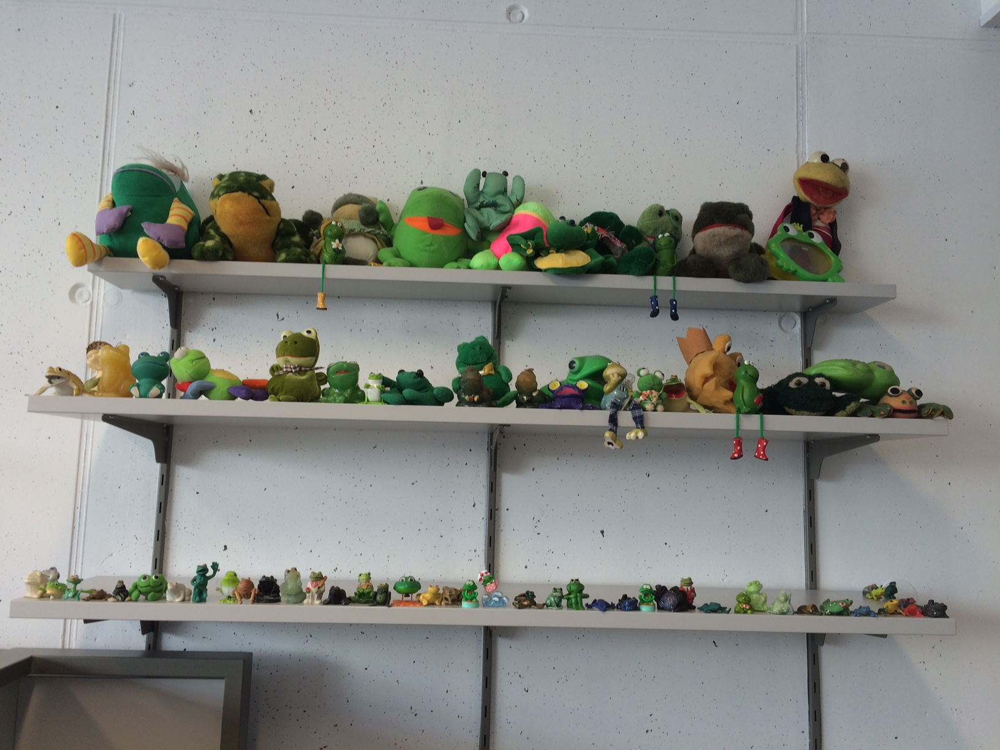

+++
title = 'Research'
date = 2024-10-05T13:36:26+02:00
draft = false
+++

# Research

---

Machine learning and data mining search for regularities in moderate to large databases by learning models of data. Generated models can be used for explanation of data, simulations, process control, prediction, and solving new related problems. An example is medical diagnostics, where from previously diagnosed patients a model for diagnosing new, previously unseen patients can be derived. Similar approaches can also be used in insurance or banking businesses, where predictive models can be used for detecting unusual or interesting patterns in a day-to-day business process.

<!--  -->



# Infrastructure

---

Besides desktop computers and notebooks, the laboratory is equipped with the following powerful computers:

#### General purpose server - Dell PowerEdge M630

---

Specifications

CPU: 2 x Intel Xeon E5-2630 V3 / 8 core, 2.40-3.20 GHz, 20 MB

Total number of CPU: 16 (32 - Hyperthreading)

RAM: 384 GB DDR4 2400 MHz

HDD: 22 TB

#### Cronos

---

Specifications

CPU: 2x Intel Xeon Silver 4214 / 12 core, 2.20 GHz, 16.5 MB

Total number of CPU: 24 (48 - Hyperthreading)

GPU: 4x Nvidia GeForce RTX 2080 Ti / 11 GB GDDR6

Total GPU memory: 44 GB

RAM: 384 GB DDR4 2400 MT/s

HDD: 512 GB SSD

NAS: 100+ TB shared storage (with other laboratories)

#### General purpose server

---

Specifications

CPU: 2x Intel Xeon Silver 4214 / 12 core, 2.20 GHz, 16.5 MB

Total number of CPU: 24 (48 - Hyperthreading)

GPU: 2x Nvidia Quadro RTX 5000 / 16 GB

Total GPU memory: 32 GB

RAM: 384 GB

NAS: 100+ TB shared storage

#### GPU server - NVidia DGX-A100

---

Specifications

CPU: 2x 64 core

GPU: 8x NVidia DGX-A100

Total GPU memory: 320 GB

RAM: 2 TB

SSD: 20 TB

<!--  -->

<!--  -->





# Topics of Research

---

- machine learning and data mining,
- modelling of numerical, symbolic, and image data,
- image analysis,
- medical diagnostics and prognostics,
- estimation of data quality and data importance,
- statistical data analysis,
- deep learning,
- interactions of various parameters,
- text summarization,
- web users profiling,
- network analysis,
- text mining,
- graph mining.

# Survey of activities

---

- [2014](../../../uploads/LKM%20Survey%20of%20activities%202014.pdf)
- [2013](../../../uploads/LKM%20Survey%20of%20activities%202013.pdf)
- [2012](../../../uploads/LKM%20Survey%20of%20activities%202012.pdf)
- [2011](../../../uploads/LKM%20Survey%20of%20activities%202011.pdf)
- [2010](../../../uploads/LKM%20Survey%20of%20activities%202010.pdf)
- [2009](../../../uploads/LKM%20Survey%20of%20activities%202009.pdf)
- [2008](../../../uploads/LKM%20Survey%20of%20activities%202008.pdf)
- [2007](../../../uploads/LKM%20Survey%20of%20activities%202007.pdf)
- [2006](../../../uploads/LKM%20Survey%20of%20activities%202006.pdf)
- [2005](../../../uploads/LKM%20Survey%20of%20activities%202005.pdf)
- [2004](../../../uploads/LKM%20Survey%20of%20activities%202004.pdf)
- [2003](../../../uploads/LKM%20Survey%20of%20activities%202003.pdf)
- [2002](../../../uploads/LKM%20Survey%20of%20activities%202002.pdf)
