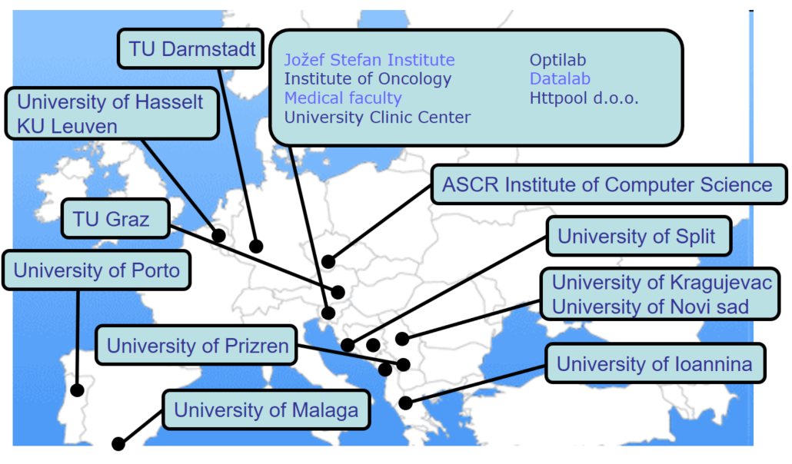

+++
title = 'Collaboration'
date = 2024-10-05T13:36:26+02:00
draft = false
+++

# Collaboration with academic institutions

- KU Leuven, Belgium
- University of Newcastle, Australia
- Technical University Graz, Austria
- South East European University, Macedonia
- TU Darmstadt, Germany
- University of Prizren, Kosovo
- University of Kragujevac, Serbia
- University of Hasselt, Belgium
- ASCR Institute of Computer Science, Czech Republic
- University of Malaga, Spain
- University of Porto, Portugal
- University of Ioannina, Greece
- Biotehnical Faculty, University of Ljubljana
- Faculty of Arts, University of Ljubljana
- FRI, Computer Vision Lab and Artificial Intelligence Lab
- University of Split, Croatia
- University of Novi sad, Serbia

# Collaboration with research institutions

- Jozef Stefan Institute; Department of knowledge technologies, Ljubljana
- The Laboratory of Neuroendocrinology - Molecular Cell Physiology; School of Medicine, Ljubljana
- Institute of Oncology, University Clinic Center, Ljubljana
- Clinic for Nuclear Medicine, University Clinic Center, Ljubljana

# Collaborators

- **prof. Jesse Davis**, KU Leuven, Belgium
- **prof. Pablo Moscato**, University of Newcastle, Australia
- **prof. Andreas Holzinger**, Technical University Graz, Austria
- **as. prof. Bujar Raufi**, South East European University, Macedonia
- **prof. Johannes Fuernkrantz**, TU Darmstadt, Germany
- **prof. dr. Nenad Filipović**, University of Kragujevac, Serbia
- **dr. Raul Fidalgo**, University of Malaga, Spain
- **dr. Petr Savicky**, Institute of Computer Science, Czech Academy of Sciences, Prague, Czech Republic
- **dr. Ciril Grošelj**, MD, Clinic for Nuclear Medicine, Ljubljana
- **prof. dr. Aris Likas**, University of Ioannina, Greece
- **prof. dr. Joao Gama**, University of Porto, Portugal
- **dr. Pedro Pereira Rodrigues**, University of Porto, Portugal
- **prof. dr. Nada Lavrač**, Jozef Stefan Institute; Department of knowledge technologies, Ljubljana, Slovenia
- **prof. dr. Marko Kreft**, The Laboratory of Neuroendocrinology - Molecular Cell Physiology; School of Medicine, Ljubljana
- **dr. Metka Milčinski**, Clinic for Nuclear Medicine, University Clinic Center, Ljubljana
- **prof. Koen Vanhoof**, University of Hasselt, Belgium
- **dr. Branko Zakotnik**, Institute of Oncology, University Clinic Center, Ljubljana
- **mag. Cvetka Grašič Kuhar**, Institute of Oncology, University Clinic Center, Ljubljana
- **doc. dr. Josip Musić**, Faculty of Electrical Engineering, Mechanical Engineering and Naval Architecture, University of Split, Croatia
