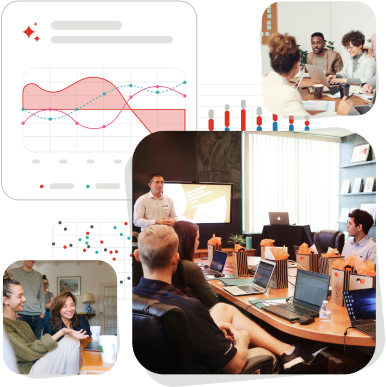

+++
title = ''
date = 2025-02-04T11:01:48+01:00
draft = false
+++



#### Laboratorij za **strojno učenje** in **jezikovne tehnologije (SUJT)**

 

Smo znanstveni laboratorij, specializiran za raziskave in razvoj na področju strojnega učenja ter jezikovnih tehnologij.



  





 

    



NAŠE DELO

#### **Naše delo se osredotoča na razumevanje in obdelavo jezika v različnih  kontekstih, kot so zdravstvo, digitalna humanistika in farmacija.**

  

Raziskujemo področja podatkovnega rudarjenja, nevronskih mrež, umetne inteligence,  analize velikih podatkovnih baz in analize velikih podatkovnih tokov.



{{< feature_cards 
  card1="**Naš cilj**  Naš cilj je ustvarjanje, izmenjava in prenašanje znanja s področja strojnega učenja in jezikovnih tehnologij."
  card2="**Projekti**  Vodimo številne nacionalne in mednarodne projekte, ki vključujejo tako  aplikativne kot teoretične raziskave, pri čemer se osredotočamo na reševanje konkretnih izzivov in hkrati poglabljamo temeljno razumevanje teh področij."
  card3="**Naše delo**  Naše delo temelji na zavezanosti interdisciplinarnosti in multi- disciplinarnosti. Združujemo znanja in pristope iz različnih znanstvenih disciplin. Tako spodbujamo  inovacije in krepimo sodelovanje med raziskovalnimi skupinami na nacionalni in mednarodni ravni." 
>}}

      
    

    



VIZIJA IN VREDNOTE

  

#### **Naš cilj je ustvarjanje, izmenjava in   prenašanje znanja**



{{< benefits 
  card1="**Naš cilj**  Naš cilj je ustvarjanje, izmenjava in prenašanje znanja s področja strojnega učenja in jezikovnih tehnologij."
  card2="**Projekti**  Vodimo številne nacionalne in mednarodne projekte, ki vključujejo tako  aplikativne kot teoretične raziskave, pri čemer se osredotočamo na reševanje konkretnih izzivov in hkrati poglabljamo temeljno razumevanje teh področij."
  card3="**Naše delo**  Naše delo temelji na zavezanosti interdisciplinarnosti in multi- disciplinarnosti. Združujemo znanja in pristope iz različnih znanstvenih disciplin. Tako spodbujamo  inovacije in krepimo sodelovanje med raziskovalnimi skupinami na nacionalni in mednarodni ravni" 
>}}



NOVICE

  

#### **Zadnje novice**



   





  



  

