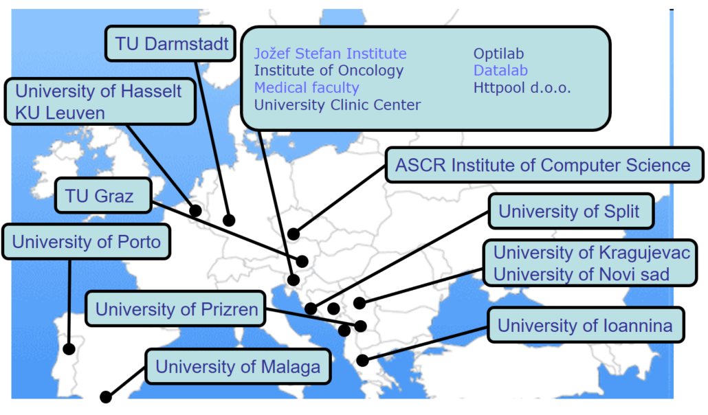

+++
title = 'Sodelovanje'
draft = false
+++

# Sodelovanje z akademskimi ustanovami

- KU Leuven, Belgija
- University of Newcastle, Avstralija
- Tehnična univerza Gradec, Avstrija
- Univerza Jugovzhodne Evrope, Makedonija
- TU Darmstadt, Nemčija
- Univerza v Prizrenu, Kosovo
- Univerza v Kragujevcu, Srbija
- Univerza v Hasseltu, Belgija
- ASCR Inštitut za računalništvo, Češka
- Univerza v Malagi, Španija
- Univerza v Portu, Portugalska
- Univerza v Ioannini, Grčija
- Biotehniška fakulteta, Univerza v Ljubljani
- Filozofska fakulteta, Univerza v Ljubljani
- FRI, Laboratorij za računalniški vid in Laboratorij za umetno inteligenco
- Univerza v Splitu, Hrvaška
- Univerza v Novem Sadu, Srbija

# Sodelovanje z raziskovalnimi ustanovami

- Institut Jožef Stefan; Oddelek za tehnologije znanja, Ljubljana
- Laboratorij za nevroendokrinologijo - Molekularna celična fiziologija; Medicinska fakulteta, Ljubljana
- Onkološki inštitut, Univerzitetni klinični center, Ljubljana
- Klinika za nuklearno medicino, Univerzitetni klinični center, Ljubljana

# Sodelavci

- **prof. Jesse Davis**, KU Leuven, Belgija
- **prof. Pablo Moscato**, University of Newcastle, Avstralija
- **prof. Andreas Holzinger**, Tehnična univerza Gradec, Avstrija
- **as. prof. Bujar Raufi**, Univerza Jugovzhodne Evrope, Makedonija
- **prof. Johannes Fuernkrantz**, TU Darmstadt, Nemčija
- **prof. dr. Nenad Filipović**, Univerza v Kragujevcu, Srbija
- **dr. Raul Fidalgo**, Univerza v Malagi, Španija
- **dr. Petr Savicky**, Inštitut za računalništvo, Češka akademija znanosti, Praga, Češka
- **dr. Ciril Grošelj**, dr. med., Klinika za nuklearno medicino, Ljubljana
- **prof. dr. Aris Likas**, Univerza v Ioannini, Grčija
- **prof. dr. Joao Gama**, Univerza v Portu, Portugalska
- **dr. Pedro Pereira Rodrigues**, Univerza v Portu, Portugalska
- **prof. dr. Nada Lavrač**, Institut Jožef Stefan; Oddelek za tehnologije znanja, Ljubljana, Slovenija
- **prof. dr. Marko Kreft**, Laboratorij za nevroendokrinologijo - Molekularna celična fiziologija; Medicinska fakulteta, Ljubljana
- **dr. Metka Milčinski**, Klinika za nuklearno medicino, Univerzitetni klinični center, Ljubljana
- **prof. Koen Vanhoof**, Univerza v Hasseltu, Belgija
- **dr. Branko Zakotnik**, Onkološki inštitut, Univerzitetni klinični center, Ljubljana
- **mag. Cvetka Grašič Kuhar**, Onkološki inštitut, Univerzitetni klinični center, Ljubljana
- **doc. dr. Josip Musić**, Fakulteta za elektrotehniko, strojništvo in pomorstvo, Univerza v Splitu, Hrvaška
